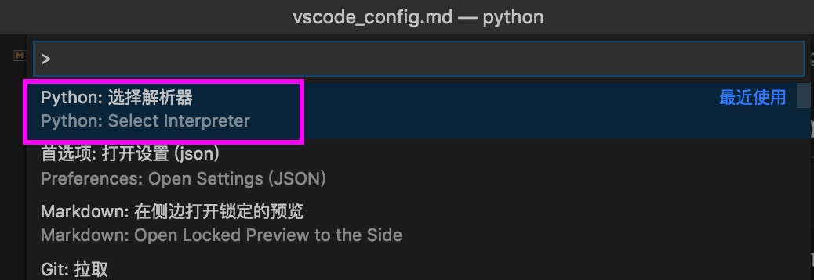
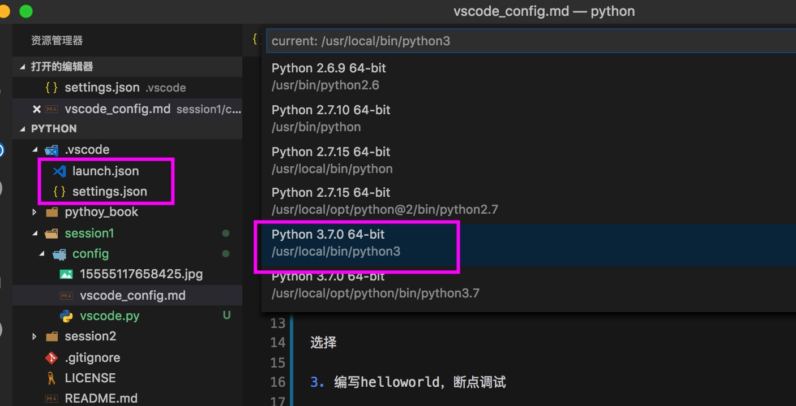
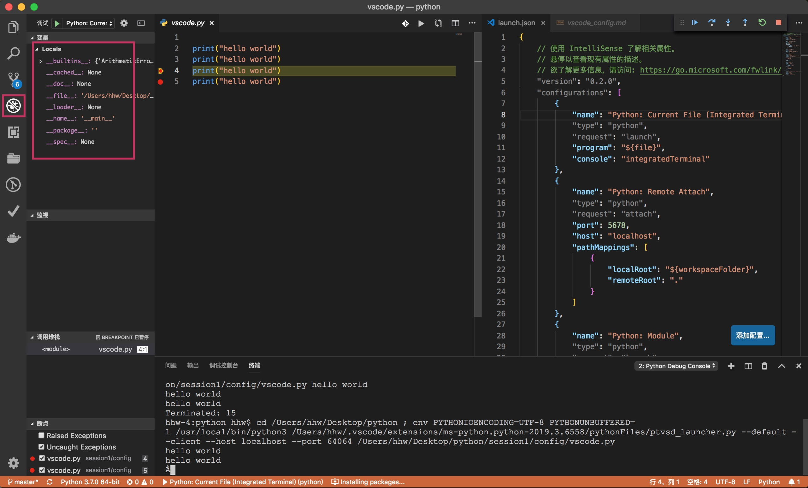
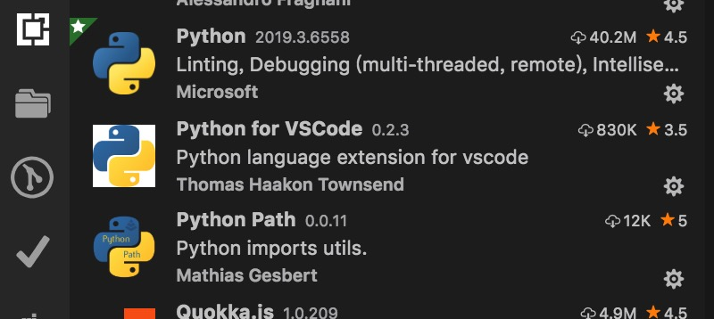

[toc]

# Mac Python 编辑器配置

#### 1. 下载Python

```
> brew install python3
```

#### 2. vscode 基本配置

配置解释器**cmd+shift+p**，如下图


选择相关解释器后，会生成.vscode文件settings.json**

```
// settings.json文件内容
{
    "python.pythonPath": "/usr/local/bin/python3"
}
```

> 但是不如直接在vscode 用户配置目录统一配置


#### 3. 编写helloworld，断点调试




#### 4. Python相关插件推荐
**插件总结后续更新**

暂时关于python的插件只用了下边三个



提示

路径

注释

格式化
[python 格式化问题](https://blog.csdn.net/sunxb10/article/details/80984243)


